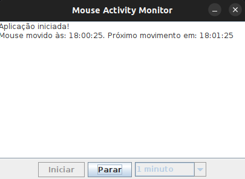

<h2 align="center"> <b> Mouse Activity Monitor </b> </h2>

  

## ✅ How to run
- run `mvn clean install` to build MouseActivityMonitor.jar
- go the target folder and run `java -jar MouseActivityMonitor.jar`

or
- run the project in your IDE.

---
Made with 💟 by [Guilherme Silva.](https://github.com/guilhermehenrysilva) 
